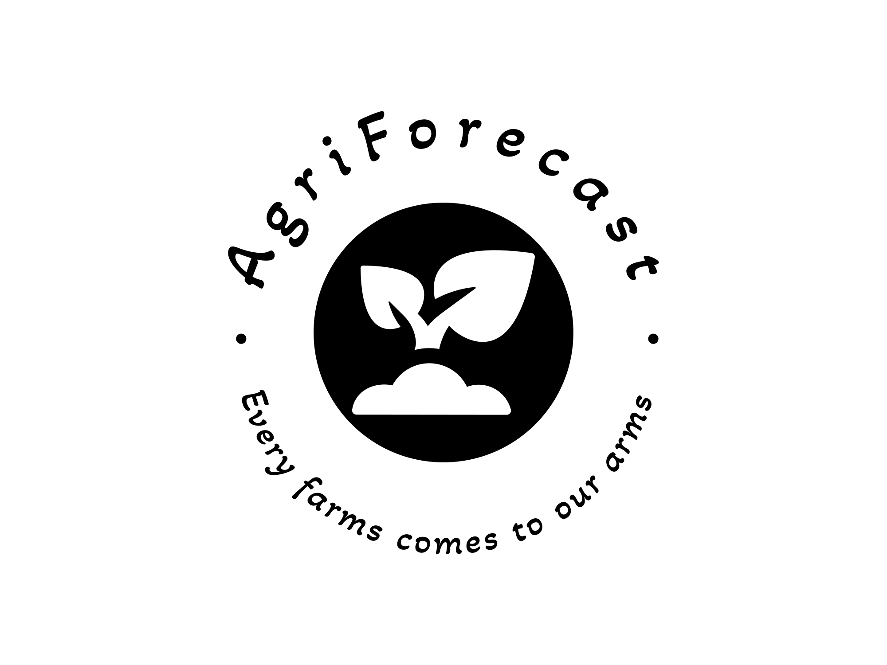

# AgriForecast- A sustainable solution for crop yield prediction using ML algorithms 




#

A Crop yield prediction solution using Machine learning to predict the crop production based on the environmental data and that will help farmers or agricultural experts to effectively analyse prodcution  or loss of crop in order to do sustainable farming.

## [Demo (Only for University of East London Staff members)](https://uelac-my.sharepoint.com/:v:/r/personal/u2045599_uel_ac_uk/Documents/Recordings/Demo%20Video%20for%20dissertation%20Manav%20Yogesh%20PATEL-20240412_142424-Meeting%20Recording.mp4?csf=1&web=1&e=MUVO0i)
 
[](https://uelac-my.sharepoint.com/:v:/r/personal/u2045599_uel_ac_uk/Documents/Recordings/Demo%20Video%20for%20dissertation%20Manav%20Yogesh%20PATEL-20240412_142424-Meeting%20Recording.mp4?csf=1&web=1&e=MUVO0i)

## Installation

NodeJS and npm which can be downloaded from the [NodeJS website](https://nodejs.org/en/download/).

# Front-End 

Clone the project

```bash
  git clone https://github.com/Manavpatel1803/AgriForecast-A-sustainable-solution-based-on-ML-Algorithms-.git
```

Go to the client directory

```bash
  cd firebase-auth
```

Installing dependencies 
```bash
  npm install 
```
Running on local environment 

```bash
  npm start 
```

Go to the server directory

```bash
  cd new
```

Initiate Virtual Environment 

```bash
  python -m venv venv
  .venv\Scripts\activate 
```

Install necessary packages 

```bash
  pip install -r requirements.txt
```

Running the server 

```bash
  flask run 
```
## Tech Stack

**Front-Side:** ReactJS

**Server-side:** Node,Firebase,Flask, 

**Machine Learning Model Development**: Random Forest, Decision Tree Regressor

**Machine Learning Playground**: Google Colaboratory.


## Acknowledgements
 - I would like to thank Mr Kazi Tansen for his expert advice, encouragement and commitment to supporting me throughout this challenging project

### Code Acknowledgements

 - [Crop Recommendation System](https://github.com/Gladiator07/Harvestify)
 - [Dataset for Crop Prediction System ](https://www.kaggle.com/datasets/patelris/crop-yield-prediction-dataset)
   
## Authors

- [@Manavpatel1803](https://github.com/Manavpatel1803)
  
